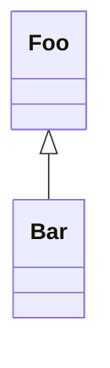

# template-bun-webapp

[](https://github.com/flowscripter/template-bun-webapp/releases)
[](https://github.com/flowscripter/template-bun-webapp/actions/workflows/release-bun-webapp.yml)
[](https://codecov.io/gh/flowscripter/template-bun-webapp)
[](https://github.com/flowscripter/template-bun-webapp/blob/main/LICENSE)

> Project template for a webapp with Bun and Rust compiled to WASM library
> dependencies.

## Hosted Webapp Demo

Go to: https://flowscripter.github.io/template-bun-webapp/

## Development

Install dependencies:

`bun install`

Test:

`bun test`

Serve dev version:

`bun html/index.html`

and verify the browser console displays:

```
Hello
World
Hello
World 6
```

Bundle:

`bun run build`

**NOTE**: The following tasks use Deno as it excels at these and Bun does not
currently provide such functionality:

Format:

`deno fmt`

Lint:

`deno lint src/ tests/`

## Functional Tests

Refer to [functional_tests/README.md](functional_tests/README.md)

## Documentation

### Overview

Sample mermaid diagram to test rendering in markdown:



## License

MIT © Flowscripter
