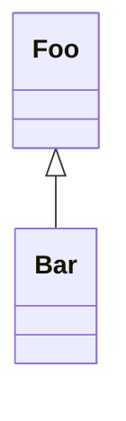

# template-bun-webapp

> Project template for a webapp with Bun and Rust compiled to WASM library dependencies.

## Hosted Webapp Demo

Go to: https://flowscripter.github.io/template-bun-webapp/

## Development

Run: `deno run --allow-net mod.ts`

Test: `deno test -A --unstable`

Lint: `deno fmt mod.ts deps.ts src/ tests/`

Bundle: `deno bundle mod.ts html/mod.bundle.js`

Serve: `cd html && python3 -m http.server 8000` and then...

Verify: Browse to http://127.0.0.1:8000/index.html and check that the browser console displays:

    INFO Hello
    INFO World
    INFO Hello
    INFO World 4

## Functional Tests

Refer to [functional_tests/README.md](functional_tests/README.md)

## Development

Install dependencies:

`bun install`

Test:

`bun test`

Run:

`bun run index.ts`

Bundle:

`bun build index.ts --outdir ./dist --entry-naming bundle.js --minify`

**NOTE**: The following tasks use Deno as it excels at these and Bun does not
currently provide such functionality:

Format:

`deno fmt`

Lint:

`deno lint index.ts src/ tests/`

## Documentation

### Overview

## License

MIT © Flowscripter

